# STEP 1 – PREPARE NFS SERVER


- Spin up a new EC2 instance with RHEL Linux 8 (ami-03951dc3553ee499f) Operating System.

- Based on your LVM experience from Project 6, Configure LVM on the Server.

- Instead of formating the disks as `ext4` you will have to format them as `xfs`

- Ensure there are 3 Logical Volumes. lv-opt lv-apps, and lv-logs
```
sudo lsblk
sudo gdisk /dev/xvdf
sudo yum install lvm2
sudo lvmdiskscan
sudo pvcreate /dev/xvdf1
sudo pvcreate /dev/xvdg1
sudo pvcreate /dev/xvdh1
sudo vgcreate webdata-vg /dev/xvdh1 /dev/xvdg1 /dev/xvdf1
sudo lvcreate -n lv-apps -L 9G webdata-vg
sudo lvcreate -n lv-opt -L 9G webdata-vg
sudo lvcreate -n lv-logs -L 9G webdata-vg

sudo mkfs -t xfs /dev/webdata-vg/lv-apps
sudo mkfs -t xfs /dev/webdata-vg/lv-opt
sudo mkfs -t xfs /dev/webdata-vg/lv-logs

```

- Create mount points on /mnt directory for the logical volumes as follow:
Mount lv-apps on /mnt/apps – To be used by webservers
Mount lv-logs on /mnt/logs – To be used by webserver logs
Mount lv-opt on /mnt/opt – To be used by Jenkins server in Project 8

```
sudo mkdir -p /mnt/apps
sudo mkdir -p /mnt/opt
sudo mkdir -p /mnt/logs

sudo mount /dev/webdata-vg/lv-apps /mnt/apps
sudo mount /dev/webdata-vg/lv-logs /mnt/logs
sudo mount /dev/webdata-vg/lv-opt /mnt/opt

```
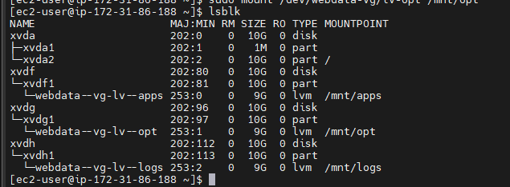


- Install NFS server, configure it to start on reboot and make sure it is up and running
```
sudo yum -y update
sudo yum install nfs-utils -y
sudo systemctl start nfs-server.service
sudo systemctl enable nfs-server.service
sudo systemctl status nfs-server.service
```
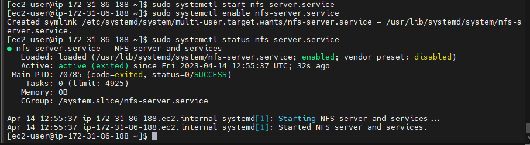

- Export the mounts for webservers’ `subnet cidr` to connect as clients. For simplicity, you will install your all three Web Servers inside the same subnet, but in production set up you would probably want to separate each tier inside its own subnet for higher level of security.
To check your `subnet cidr` – open your EC2 details in AWS web console and locate ‘Networking’ tab and open a Subnet link:


- Make sure we set up permission that will allow our Web servers to read, write and execute files on NFS:
```
sudo chown -R nobody: /mnt/apps
sudo chown -R nobody: /mnt/logs
sudo chown -R nobody: /mnt/opt

sudo chmod -R 777 /mnt/apps
sudo chmod -R 777 /mnt/logs
sudo chmod -R 777 /mnt/opt

sudo systemctl restart nfs-server.service
```   

- Configure access to NFS for clients within the same subnet (example of Subnet CIDR – 172.31.32.0/20 ):
```
sudo vi /etc/exports

/mnt/apps <Subnet-CIDR>(rw,sync,no_all_squash,no_root_squash)
/mnt/logs <Subnet-CIDR>(rw,sync,no_all_squash,no_root_squash)
/mnt/opt <Subnet-CIDR>(rw,sync,no_all_squash,no_root_squash)

Esc + :wq!

sudo exportfs -arv
```   
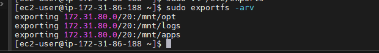

- Check which port is used by NFS and open it using Security Groups (add new Inbound Rule)
```
rpcinfo -p | grep nfs
```
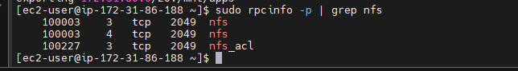

**Important note:** In order for NFS server to be accessible from your client, you must also open following ports: TCP 111, UDP 111, UDP 2049

# STEP 2 — CONFIGURE THE DATABASE SERVER


- Install MySQL server
```
sudo apt install mysql-server -y
```
- Create a database and name it `tooling`
```
sudo mysql
create database tooling;
```
- Create a database user and name it `webaccess`
```
create user 'webaccess'@'<subnet-cidr>' identified by 'password';
```
- Grant permission to `webaccess` user on `tooling` database to do anything only from the webservers `subnet cidr` 
```
grant all privileges on tooling.* to 'webaccess'@'<subnet cidr>';
flush privileges;
``` 
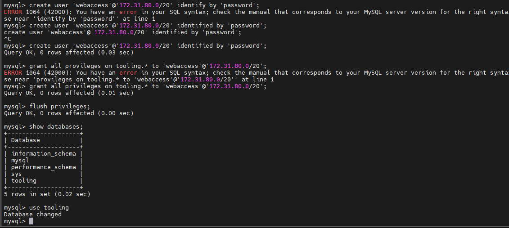   

- Edit config file. change bind addresses to 0.0.0.0
```
sudo vi /etc/mysql/mysql.conf.d/mysqld.cnf
```   
- restart mysql
```
sudo systemctl restart mysql
```

# Step 3 — Prepare the Web Servers
We need to make sure that our Web Servers can serve the same content from shared storage solutions, in our case – NFS Server and MySQL database.
You already know that one DB can be accessed for reads and writes by multiple clients. For storing shared files that our Web Servers will use – we will utilize NFS and mount previously created Logical Volume lv-apps to the folder where Apache stores files to be served to the users (/var/www).

This approach will make our Web Servers stateless, which means we will be able to add new ones or remove them whenever we need, and the integrity of the data (in the database and on NFS) will be preserved.

During the next steps we will do following:

Configure NFS client (this step must be done on all three servers)
Deploy a Tooling application to our Web Servers into a shared NFS folder
Configure the Web Servers to work with a single MySQL database   

- Launch a new EC2 instance with RHEL 8 Operating System (ami-03951dc3553ee499f)

Install NFS client
```
sudo yum install nfs-utils nfs4-acl-tools -y
```
- Mount `/var/www/` and target the NFS server’s export for apps
```
sudo mkdir /var/www
sudo mount -t nfs -o rw,nosuid <NFS-Server-Private-IP-Address>:/mnt/apps /var/www
```

- Verify that NFS was mounted successfully by running df -h. Make sure that the changes will persist on Web Server after reboot:
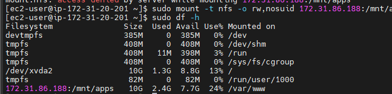  

```
sudo vi /etc/fstab
```
- add following line
```
<NFS-Server-Private-IP-Address>:/mnt/apps /var/www nfs defaults 0 0
```
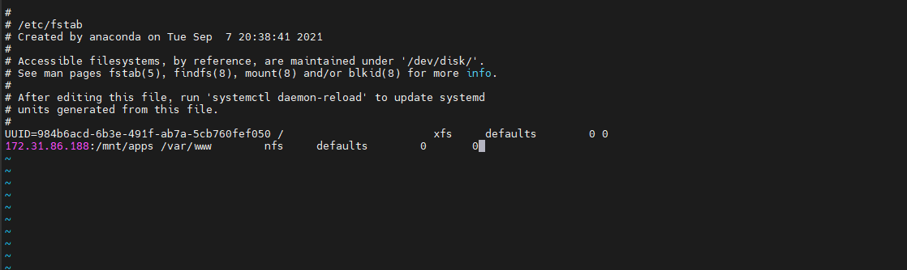  

- Install Remi’s repository, Apache and PHP
```
sudo yum install httpd -y

sudo dnf install https://dl.fedoraproject.org/pub/epel/epel-release-latest-8.noarch.rpm

sudo dnf install dnf-utils http://rpms.remirepo.net/enterprise/remi-release-8.rpm

sudo dnf module reset php

sudo dnf module enable php:remi-7.4

sudo dnf install php php-opcache php-gd php-curl php-mysqlnd

sudo systemctl start php-fpm

sudo systemctl enable php-fpm

setsebool -P httpd_execmem 1
```

- Repeat steps 1-5 for another 2 Web Servers.

- Verify that Apache files and directories are available on the Web Server in `/var/www` and also on the NFS server in `/mnt/apps`. If you see the same files – it means NFS is mounted correctly. You can try to create a new file `touch test.txt` from one server and check if the same file is accessible from other Web Servers.   

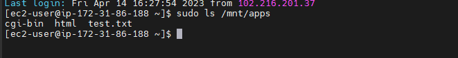
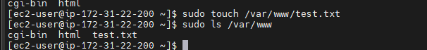


- Locate the log folder for Apache on the Web Server and mount it to NFS server’s export for logs. Repeat step №4 to make sure the mount point will persist after reboot.

```
sudo mount -t nfs -o rw,nosuid <NFS-Server-Private-IP-Address>:/mnt/logs /var/log/httpd
```
```
sudo vi /etc/fstab
```
- add following line
```
<NFS-Server-Private-IP-Address>:/mnt/logs /var/log/httpd nfs defaults 0 0
```
- Fork the tooling source code from Darey.io Github Account (https://github.com/darey-io/tooling.git) to your Github account. (Learn how to fork a repo here)

- Deploy the tooling website’s code to the Webserver. Ensure that the html folder from the repository is deployed to `/var/www/html`
   
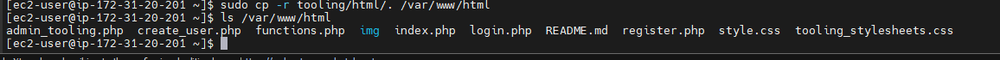

**Note 1:** Do not forget to open TCP port 80 on the Web Server.

**Note 2:** If you encounter 403 Error – check permissions to your `/var/www/html` folder and also disable SELinux `sudo setenforce 0`
To make this change permanent – open following config file `sudo vi /etc/sysconfig/selinux` and set `SELINUX=disabled` then restrt httpd `sudo systemctl restart httpd`.

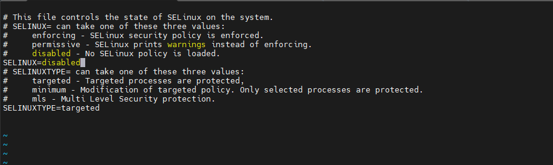   

- Update the website’s configuration to connect to the database (in `/var/www/html/functions.php` file).
   
   
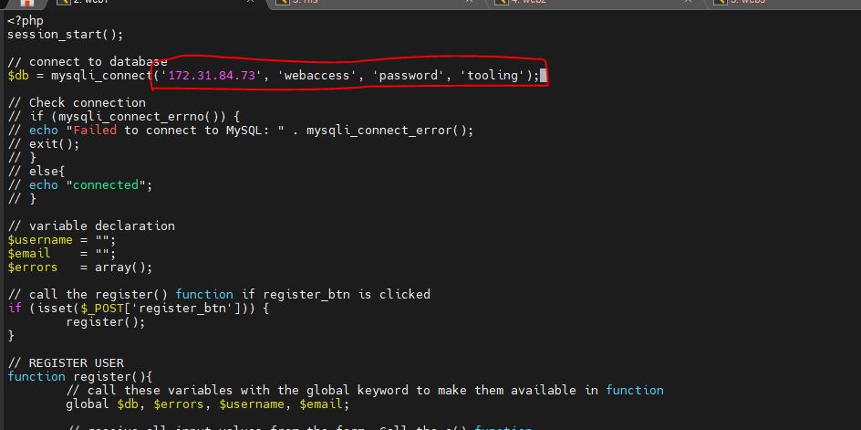   

Apply `tooling-db.sql` script to your database using this command `mysql -h <databse-private-ip> -u <db-username> -p tooling < tooling-db.sql`

- Create in MySQL a new admin user with username: `myuser` and password: `password:`

- INSERT INTO ‘users’ (‘id’, ‘username’, ‘password’, ’email’, ‘user_type’, ‘status’) VALUES
-> (1, ‘myuser’, ‘5f4dcc3b5aa765d61d8327deb882cf99’, ‘user@mail.com’, ‘admin’, ‘1’);

- Open the website in your browser `http://<Web-Server-Public-IP-Address-or-Public-DNS-Name>/index.php` and make sure you can login into the websute with `myuser` user.
   
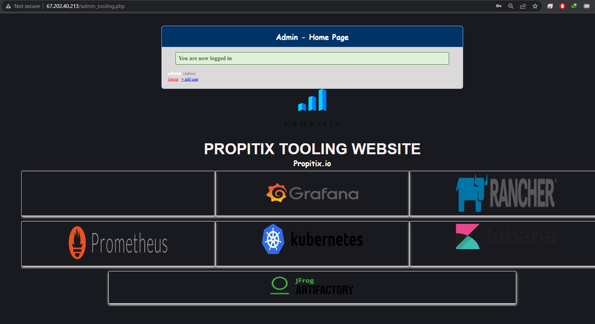


Congratulations!
You have just implemented a web solution for a DevOps team using LAMP stack with remote Database and NFS servers.

